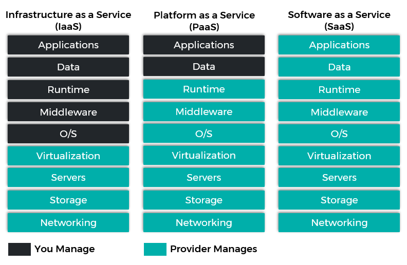

## Home Work 1 CS441

#### Vivek Mishra

#### University of Illinois at Chicago

### Introduction

In this assignment our aim is to analyze and build various cloud architectures with multiple datacenters each of which
offers different mixes of SaaS, PaaS and IaaS model implementations with various pricing criteria, each of the
datacenter having multiple hosts, host network topology and multiple allocation policies for VM, Cloudlet scheduling
policies and finally the costs associated with cloudlets and VMs on this cloud infrastructure.

CloudSim Plus is a modern, up-to-date, full-featured and fully documented simulation framework. It’s easy to use and
extend, enabling modeling, simulation, and experimentation of Cloud computing infrastructures and application services.
Based on the CloudSim framework, it aims to improve several engineering aspects, such as maintainability, reusability
and extensibility.

### Installation instructions

This section contains the instructions on how to run the simulations implemented as part of this assignment,

1. Clone the repository to your local machine using

    ```
    $ git clone git@github.com:vivek721/CloudOrg-Simulator.git
    ```
3. Go to the cloned repository location on your terminal and test the program using sbt clean compile test
4. Go to the cloned repository location on your terminal and compile the program using sbt clean compile run
5. The output prints a table of results for execution of 500 cloudlets.

Note: The cloudsim framework has been compiled in jar files and added in the lib/ folder of the project. Please note
that, although IntellJ IDEA shall recognise the dependencies automatically, this may sometimes fail. When this happens
go to “File -> Project Structure”, select “Libraries” on the right-hand side and add the provided jars manually.

### Project structure

In this section the project structure is described.

#### Simulations

The following Simulations are provided:

- *IaaSDatacenterSim*: Simulation showing IaaS functionality with several VM and DatacenterBroker policies. The policies
  can be changed from the config file. The results of the simulation can be seen in the analysis section. The
  configuration file used for IaaS simulations is "simulationIaaS.conf"

  *Provider*:- The provider provides the basic infrastructure and hardware like Servers, storage, networks.

  *Client*:- The consumer selects the Operating system, runtime, cloudlets and the VM specification.


- *PaaSDatacenterSim*: Simulation showing PaaS functionality. The results of the simulation can be seen in the analysis
  section. The configuration file used for IaaS simulations is "simulationPaaS.conf"

  *Provider*:- The provider has control over the datacenter and its Servers, storage, networks along with this he also has
  control over middleware, OS and the runtime.

  *Client*:- The consumer has the control over the application and its data apart from this the consumer has no control.


- *SaaSDatacenterSim*: Simulation showing SaaS functionality. The results of the simulation can be seen in the analysis
  section. The configuration file used for IaaS simulations is "simulationSaaS.conf"
  
  *Provider*:- The provider has control on all datacenter and its resouce along with this they also have conrol over the
  application.

  *Consumer*:- The consumer has no control over the application, they just provide the cloudlet specification such as
  cloudlet length.



#### Tests

The following test classes are provided:

- SimulationTestSuite

### Evaluation and Analysis of the results

The analysis is made by comparing different parameters and policies in different simulations.
There are three main simulations one for each model. In IaaS model the client has the most control
over all the resources we are using IaaS model to scrutinize different parameters.
Let go through all the parameters one by one:

###### Broker Implementations
A broker implements the policies for selecting a VM to run a Cloudlet and a Datacenter to run the submitted VMs. 

- *DatacenterBrokerSimple*: A simple implementation of DatacenterBroker that try to host customer's VMs at the first Datacenter found.
 If there isn't capacity in that one, it will try the other ones. 
```
                                         SIMULATION RESULTS

Cloudlet|Status |DC|Host|Host PEs |VM|VM PEs   |CloudletLen|CloudletPEs|StartTime|FinishTime|ExecTime
      ID|       |ID|  ID|CPU cores|ID|CPU cores|         MI|  CPU cores|  Seconds|   Seconds| Seconds
-----------------------------------------------------------------------------------------------------
       0|SUCCESS| 1|   0|        4| 0|        2|      10000|          2|       60|        80|      20
       1|SUCCESS| 1|   0|        4| 1|        2|      10000|          2|       60|        80|      20
       2|SUCCESS| 1|   0|        4| 2|        2|      10000|          2|       60|        80|      20
       3|SUCCESS| 1|   0|        4| 3|        2|      10000|          2|       60|        80|      20
       4|SUCCESS| 1|   0|        4| 4|        2|      10000|          2|       60|        80|      20
       5|SUCCESS| 1|   0|        4| 5|        2|      10000|          2|       60|        80|      20
       6|SUCCESS| 1|   0|        4| 6|        2|      10000|          2|       60|        80|      20
       7|SUCCESS| 1|   0|        4| 7|        2|      10000|          2|       60|        80|      20
       8|SUCCESS| 1|   0|        4| 8|        2|      10000|          2|       60|        80|      20
       9|SUCCESS| 2|   0|        4| 9|        2|      10000|          2|       60|        80|      20
      10|SUCCESS| 2|   0|        4|10|        2|      10000|          2|       60|        80|      20
      11|SUCCESS| 2|   0|        4|11|        2|      10000|          2|       60|        80|      20
      12|SUCCESS| 2|   0|        4|12|        2|      10000|          2|       60|        80|      20
      13|SUCCESS| 2|   0|        4|13|        2|      10000|          2|       60|        80|      20
      14|SUCCESS| 2|   0|        4|14|        2|      10000|          2|       60|        80|      20
      15|SUCCESS| 2|   0|        4|15|        2|      10000|          2|       60|        80|      20
      16|SUCCESS| 2|   0|        4|16|        2|      10000|          2|       60|        80|      20
      17|SUCCESS| 2|   0|        4|17|        2|      10000|          2|       60|        80|      20
      18|SUCCESS| 2|   1|        4|18|        2|      10000|          2|       60|        80|      20
      19|SUCCESS| 2|   1|        4|19|        2|      10000|          2|       60|        80|      20
      20|SUCCESS| 1|   0|        4| 0|        2|      10000|          2|       80|       100|      20
      21|SUCCESS| 1|   0|        4| 1|        2|      10000|          2|       80|       100|      20
      22|SUCCESS| 1|   0|        4| 2|        2|      10000|          2|       80|       100|      20
      23|SUCCESS| 1|   0|        4| 3|        2|      10000|          2|       80|       100|      20
      24|SUCCESS| 1|   0|        4| 4|        2|      10000|          2|       80|       100|      20
      25|SUCCESS| 1|   0|        4| 5|        2|      10000|          2|       80|       100|      20
      26|SUCCESS| 1|   0|        4| 6|        2|      10000|          2|       80|       100|      20
      27|SUCCESS| 1|   0|        4| 7|        2|      10000|          2|       80|       100|      20
      28|SUCCESS| 1|   0|        4| 8|        2|      10000|          2|       80|       100|      20
      29|SUCCESS| 2|   0|        4| 9|        2|      10000|          2|       80|       100|      20
      30|SUCCESS| 2|   0|        4|10|        2|      10000|          2|       80|       100|      20
      31|SUCCESS| 2|   0|        4|11|        2|      10000|          2|       80|       100|      20
      32|SUCCESS| 2|   0|        4|12|        2|      10000|          2|       80|       100|      20
      33|SUCCESS| 2|   0|        4|13|        2|      10000|          2|       80|       100|      20
      34|SUCCESS| 2|   0|        4|14|        2|      10000|          2|       80|       100|      20
      35|SUCCESS| 2|   0|        4|15|        2|      10000|          2|       80|       100|      20
      36|SUCCESS| 2|   0|        4|16|        2|      10000|          2|       80|       100|      20
      37|SUCCESS| 2|   0|        4|17|        2|      10000|          2|       80|       100|      20
      38|SUCCESS| 2|   1|        4|18|        2|      10000|          2|       80|       100|      20
      39|SUCCESS| 2|   1|        4|19|        2|      10000|          2|       80|       100|      20
-----------------------------------------------------------------------------------------------------

```

- *DatacenterBrokerFirstFit*: Uses a First Fit mapping between submitted cloudlets and Vm's, 
  trying to place a Cloudlet at the first suitable Vm which can be found (according to the required Cloudlet's PEs)

```
                          SIMULATION RESULTS
Cloudlet|Status |DC|Host|Host PEs |VM|VM PEs   |CloudletLen|CloudletPEs|StartTime|FinishTime|ExecTime
      ID|       |ID|  ID|CPU cores|ID|CPU cores|         MI|  CPU cores|  Seconds|   Seconds| Seconds
-----------------------------------------------------------------------------------------------------
       0|SUCCESS| 1|   0|        4| 0|        2|      10000|          2|       60|        80|      20
       1|SUCCESS| 1|   0|        4| 1|        2|      10000|          2|       60|        80|      20
       2|SUCCESS| 1|   0|        4| 2|        2|      10000|          2|       60|        80|      20
       3|SUCCESS| 1|   0|        4| 3|        2|      10000|          2|       60|        80|      20
       4|SUCCESS| 1|   0|        4| 4|        2|      10000|          2|       60|        80|      20
       5|SUCCESS| 1|   0|        4| 5|        2|      10000|          2|       60|        80|      20
       6|SUCCESS| 1|   0|        4| 6|        2|      10000|          2|       60|        80|      20
       7|SUCCESS| 1|   0|        4| 7|        2|      10000|          2|       60|        80|      20
       8|SUCCESS| 1|   0|        4| 8|        2|      10000|          2|       60|        80|      20
       9|SUCCESS| 2|   0|        4| 9|        2|      10000|          2|       60|        80|      20
      10|SUCCESS| 2|   0|        4|10|        2|      10000|          2|       60|        80|      20
      11|SUCCESS| 2|   0|        4|11|        2|      10000|          2|       60|        80|      20
      12|SUCCESS| 2|   0|        4|12|        2|      10000|          2|       60|        80|      20
      13|SUCCESS| 2|   0|        4|13|        2|      10000|          2|       60|        80|      20
      14|SUCCESS| 2|   0|        4|14|        2|      10000|          2|       60|        80|      20
      15|SUCCESS| 2|   0|        4|15|        2|      10000|          2|       60|        80|      20
      16|SUCCESS| 2|   0|        4|16|        2|      10000|          2|       60|        80|      20
      17|SUCCESS| 2|   0|        4|17|        2|      10000|          2|       60|        80|      20
      18|SUCCESS| 2|   1|        4|18|        2|      10000|          2|       60|        80|      20
      19|SUCCESS| 2|   1|        4|19|        2|      10000|          2|       60|        80|      20
-----------------------------------------------------------------------------------------------------
```

- *DatacenterBrokerBestFit*: Uses a Best Fit mapping between submitted cloudlets and Vm's, 
 trying to place a Cloudlet at the best suitable Vm which can be found (according to the required Cloudlet's PEs)

```
                                         SIMULATION RESULTS

Cloudlet|Status |DC|Host|Host PEs |VM|VM PEs   |CloudletLen|CloudletPEs|StartTime|FinishTime|ExecTime
      ID|       |ID|  ID|CPU cores|ID|CPU cores|         MI|  CPU cores|  Seconds|   Seconds| Seconds
-----------------------------------------------------------------------------------------------------
       0|SUCCESS| 1|   0|        4| 0|        2|      10000|          2|       60|        80|      20
       1|SUCCESS| 1|   0|        4| 1|        2|      10000|          2|       60|        80|      20
       2|SUCCESS| 1|   0|        4| 2|        2|      10000|          2|       60|        80|      20
       3|SUCCESS| 1|   0|        4| 3|        2|      10000|          2|       60|        80|      20
       4|SUCCESS| 1|   0|        4| 4|        2|      10000|          2|       60|        80|      20
       5|SUCCESS| 1|   0|        4| 5|        2|      10000|          2|       60|        80|      20
       6|SUCCESS| 1|   0|        4| 6|        2|      10000|          2|       60|        80|      20
       7|SUCCESS| 1|   0|        4| 7|        2|      10000|          2|       60|        80|      20
       8|SUCCESS| 1|   0|        4| 8|        2|      10000|          2|       60|        80|      20
       9|SUCCESS| 2|   0|        4| 9|        2|      10000|          2|       60|        80|      20
      10|SUCCESS| 2|   0|        4|10|        2|      10000|          2|       60|        80|      20
      11|SUCCESS| 2|   0|        4|11|        2|      10000|          2|       60|        80|      20
      12|SUCCESS| 2|   0|        4|12|        2|      10000|          2|       60|        80|      20
      13|SUCCESS| 2|   0|        4|13|        2|      10000|          2|       60|        80|      20
      14|SUCCESS| 2|   0|        4|14|        2|      10000|          2|       60|        80|      20
      15|SUCCESS| 2|   0|        4|15|        2|      10000|          2|       60|        80|      20
      16|SUCCESS| 2|   0|        4|16|        2|      10000|          2|       60|        80|      20
      17|SUCCESS| 2|   0|        4|17|        2|      10000|          2|       60|        80|      20
      18|SUCCESS| 2|   1|        4|18|        2|      10000|          2|       60|        80|      20
      19|SUCCESS| 2|   1|        4|19|        2|      10000|          2|       60|        80|      20
-----------------------------------------------------------------------------------------------------

```

###### VM_Allocation_Policies

Vm Allocation Policies enable the Datacenter to select a Host to place or migrate a VM.
As we have 2 datacenters in our IaaS model we can set different VM allocation policies for both the
datacenters.

- *VmAllocationPolicySimple*: A VmAllocationPolicy implementation that chooses, as the host for 
 a VM, that one with fewer PEs in use. It is therefore a Worst Fit policy, allocating VMs into the host with most available PEs.
```text
18:24:19.950 [main] INFO  VmAllocationPolicy - 36.10: VmAllocationPolicySimple: Vm 0 has been allocated to Host 0/DC 2
18:24:19.951 [main] INFO  VmAllocationPolicy - 36.10: VmAllocationPolicySimple: Vm 1 has been allocated to Host 1/DC 2
18:24:19.952 [main] INFO  VmAllocationPolicy - 36.10: VmAllocationPolicySimple: Vm 2 has been allocated to Host 1/DC 2
```
- *VmAllocationPolicyRoundRobin*: A Round-Robin VM allocation policy which finds the next Host having suitable 
resources to place a given VM in a circular way. That means when it selects a suitable Host to place a VM, 
it moves to the next suitable Host when a new VM has to be placed.

```text
18:24:19.941 [main] WARN  VmAllocationPolicy - 12.00: VmAllocationPolicyRoundRobin: No suitable host found for Vm 0 in Datacenter 1
18:24:19.942 [main] WARN  VmAllocationPolicy - 12.00: VmAllocationPolicyRoundRobin: No suitable host found for Vm 1 in Datacenter 1
18:24:19.942 [main] WARN  VmAllocationPolicy - 12.00: VmAllocationPolicyRoundRobin: No suitable host found for Vm 2 in Datacenter 1
```
- *VmAllocationPolicyBestFit*:A VmAllocationPolicy implementation that chooses, as the host for a VM, that one with the most PEs in use. It is therefore a Best Fit policy,
allocating each VM into the host with the least available PEs that are enough for the VM.

```text
18:28:45.505 [main] INFO  VmAllocationPolicy - 36.10: VmAllocationPolicyBestFit: Vm 0 has been allocated to Host 0/DC 2
18:28:45.506 [main] INFO  VmAllocationPolicy - 36.10: VmAllocationPolicyBestFit: Vm 1 has been allocated to Host 0/DC 2
18:28:45.507 [main] INFO  VmAllocationPolicy - 36.10: VmAllocationPolicyBestFit: Vm 2 has been allocated to Host 0/DC 2
```

###### UtilizationModelDynamic

A Cloudlet UtilizationModel that allows to increase the utilization of the related resource
along the simulation time.

###### Cost
This is a key factor of cloud computing and can effectively guide our choice of a cloud 
architecture.
The cost is computed as the cost per second multiplied by the 
actual run time of the cloudlet plus the time taken to transfer data between 
the cloudlets: cost_per_sec * (cpu_time + delay_data_loading)

```text

                                         SIMULATION RESULTS

Cloudlet|Status |DC|Host|Host PEs |VM|VM PEs   |CloudletLen|CloudletPEs|StartTime|FinishTime|ExecTime
      ID|       |ID|  ID|CPU cores|ID|CPU cores|         MI|  CPU cores|  Seconds|   Seconds| Seconds
-----------------------------------------------------------------------------------------------------
       0|SUCCESS| 2|   0|        2| 0|        2|      10000|          2|       60|        80|      20
       1|SUCCESS| 2|   0|        2| 1|        2|      10000|          2|       60|        80|      20
       2|SUCCESS| 2|   0|        2| 2|        2|      10000|          2|       60|        80|      20
       3|SUCCESS| 2|   0|        2| 0|        2|      10000|          2|       80|       100|      20
       4|SUCCESS| 2|   0|        2| 1|        2|      10000|          2|       80|       100|      20
-----------------------------------------------------------------------------------------------------
Vm 0 costs ($) for    76.43 execution seconds - CPU:     0.31$ RAM:    20.56$ Storage:    10.00$ BW:    10.00$ Total:    40.87$
Vm 1 costs ($) for    76.43 execution seconds - CPU:     0.31$ RAM:    20.56$ Storage:    10.00$ BW:    10.00$ Total:    40.87$
Vm 2 costs ($) for    76.43 execution seconds - CPU:     0.31$ RAM:    20.56$ Storage:    10.00$ BW:    10.00$ Total:    40.87$
Total cost ($) for   3 created VMs from   3 in DC   :     0.92$         61.68$             30.00$        30.00$          122.60$
```